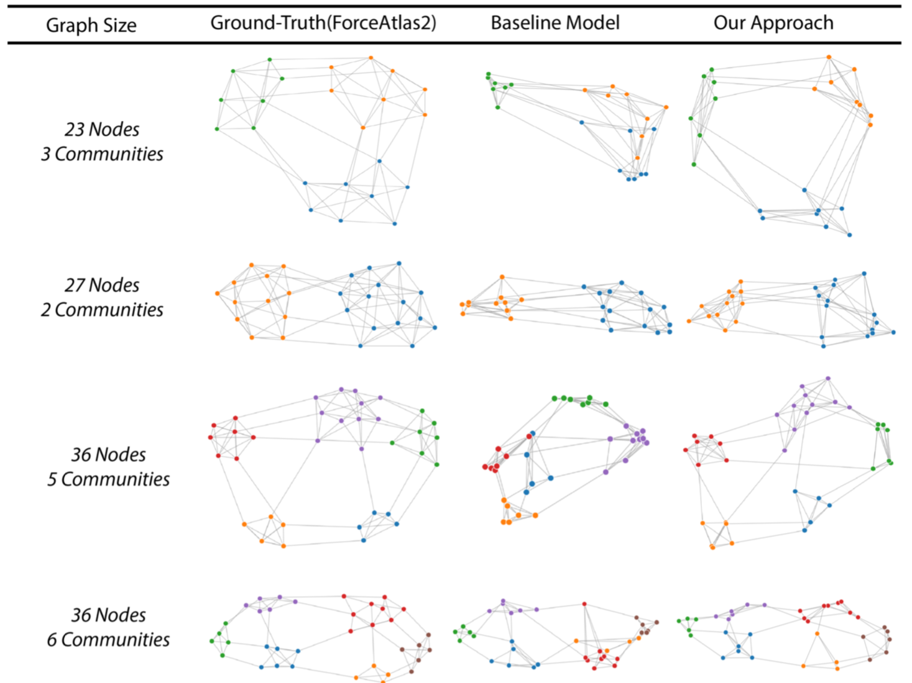
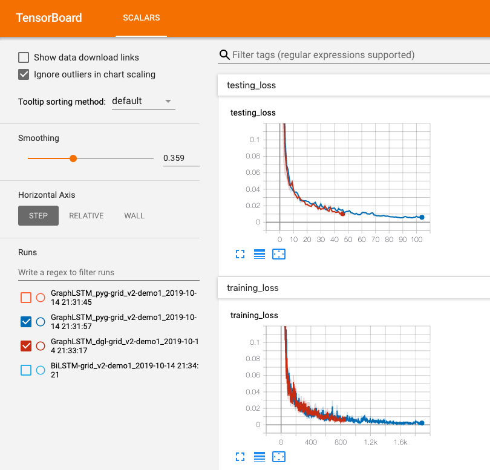

# DeepDrawing: A Deep Learning Approach to Graph Drawing



## Introduction
This is the code repository for our IEEE VIS19 Paper entitled "DeepDrawing: A Deep Learning Approach to Graph Drawing". We propose a deep learning based approach to learn from existing graph drawings of a similar drawing style. Then, given a new graph, the trained model directly predict the layout (i.e., the coordinates of the nodes) of a drawing style similar to the training dataset.

You can also check our [project webpage](http://yong-wang.org/proj/deepDrawing.html) for more details.

## Citation
If you find our work useful in your research, please consider citing:
```
@ARTICLE{wang19deepdrawing, 
  author  = {Wang, Yong and Jin, Zhihua and Wang, Qianwen and Cui, Weiwei and Ma, Tengfei and Qu, Huamin},
  title   = {DeepDrawing: A Deep Learning Approach to Graph Drawing},
  journal = {IEEE Transactions on Visualization and Computer Graphics},
  year    = {2019}, 
  volume  = {}, 
  number  = {}, 
  pages   = {1-1}
}
```

## Installation


### Download the code
You can simply download the code by using github:
```
$ git clone https://github.com/jiayouwyhit/DL4GD-code.git
```

### Prerequisites
Install [Conda](https://docs.conda.io/en/latest/) on your computer. Then run the following command to install all the dependencies:
```
$ conda env create --name deepdrawing --file=./config/env.yml
```
Enter the corresponding conda environment:
```
$ conda activate deepdrawing
```
All the following command will be executed in this environment.

Note that it may be a bit tricky to successfully install PyTorch geometric (PyG). Here we list the package versions where we successfully install it by using the above conda installation command.

- OS: Ubuntu (16.04.5 LTS (Xenial Xerus))
- gcc:5.4.0
- cuda: 9.0
- python: 3.6.8
- torch: 1.0.0
- torch-scatter: 1.1.2
- torch-sparse: 0.2.4
- torch-cluster: 1.2.4
- torch-spline-conv: 1.0.6
- torch-geometric: 1.0.3

We tested the case where gcc version == 7.4.0, but failed to successfully install the dependencies of torch-geometric. So we would advise readers to use the above package versions in order to successfully build the environment. For other issues of installing torch-scatter, torch-sparse, torch-cluster and torch-spline-conv, please refer to [the official installation guidelines of PyG](https://pytorch-geometric.readthedocs.io/en/latest/notes/installation.html).

### Launch

#### Model Training
Please download the grid dataset from [this link](https://drive.google.com/drive/folders/1LjxuVp_eIA3Z0CT7ctFr-U3tmakVj2aR?usp=sharing) and put all the corresponding data folders to the folder ``main_data_folder/data''.

Then go to the main folder and run 
```
$ python main_train.py
```
Then the terminal will print out the model information and the corresponding training epochs. You may also use the following command to track the training progress:
```
$ tensorboard --logdir=./tensorboard  --port=6007
```


If you open your browser (http://localhost:6007), you will be able to see the loss plots like this:




In this repository, we implemented the GraphLSTM model with two different libraries: [PyG](https://github.com/rusty1s/pytorch_geometric) and [DGL](https://docs.dgl.ai/tutorials/models/index.html). According to our observation, the PyG-based implementation is faster than the DGL-based implementation. You can change the configurations in the file ``main_train.py''.

#### Model Testing
The trained model will be saved in the folder ``main_data_folder/model_save''. You may select the appropriate model and change the configurations in the file ``main_test.py''. We have also put a file of the trained model in the [this link](https://drive.google.com/drive/folders/1LjxuVp_eIA3Z0CT7ctFr-U3tmakVj2aR?usp=sharing). You may put it to ``main_data_folder/model_save'' to run a quick demo. 

Use the followinig command to check the testing result:
```
$ python main_test.py
```
The visualization results can be found in the folder "main_data_folder/testing_results".

## Data
Here we use the grid dataset as an example to show how the data look like. Basically, all the data will follow the following format:
```
{
  // Core Attribute
  ori -> object, topological information about the graph, includes
  {
    id -> graph id,
    nodelist -> a list contains node information, one row contains [node_id, node_group, cx, cy, r, fill],
    linelist -> a list contains line information, one row contains [node_id_1, node_id_2] representing those two nodes are connected,
    width -> canvas width,
    height -> canvas height
  }
  x_idx -> specify which nodes current feature corresponding to.
  x_ridx -> specify the node in original order index corresponding to which nodes in the new order index.
  x -> input feature
  pos -> normalized coordinates

  // Auxiliary attribute
  len -> the number of nodes
  bounding_box -> object, specifying the bounding box of layout, includes
  {
    left,right,top,bottom
  }
  adj -> Adjacency matrix,
  graph -> Adjacency table,
  connected -> whether this graph is connected.
}
```

## Note
The code in this repository is under active development. Also, the current approach is only tested on graphs of a small number of nodes.